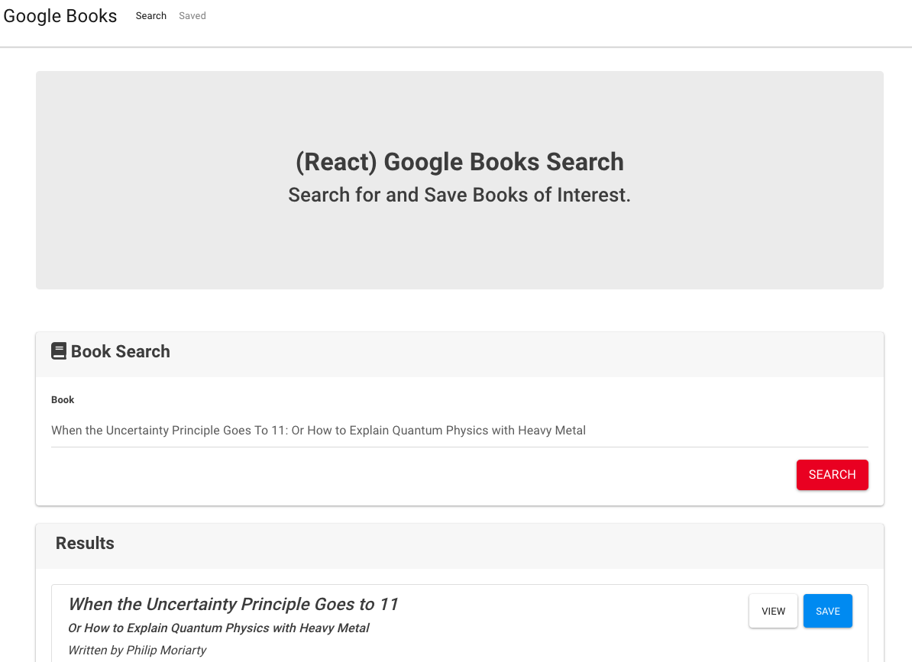
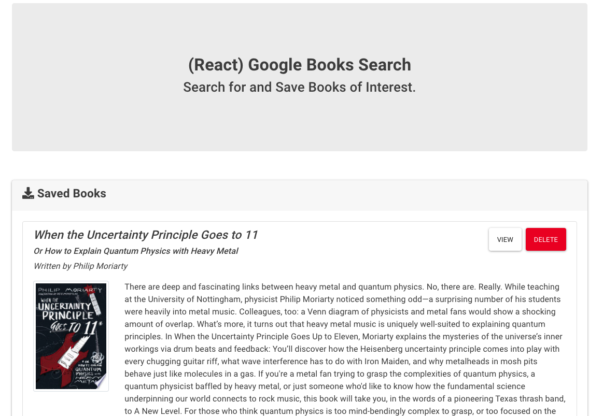

# Google-Book-Search

## Table of Contents

* [Description](#Description)
* [Installation](#Installation)
* [Screenshots](#Screenshots)
* [Contributing](#Contributing)
* [Tests](#Tests)
* [License](#License)
* [Questions](#Questions)

## Description


The purpose of this assignment was to create a way to search, save and look up books using a web application utilizing React and the Google Books API.  Axios is used to call the API in React.   

Live app: https://thawing-ocean-63699.herokuapp.com/


## Installation
1. Clone the repo
```sh
https://github.com/AWSiegfried/HW21-google-book.git
```

2. Install NPM packages
```sh
npm install
```

## Screenshot




## Contributing

Please feel free to contribute to this repo! Emails are appreciated (email address below) but even then, hopefully it just helps you out!


## Tests

Test your library
```sh
npm test
```

## License

This repository is not covered under any license. 

## Questions
Please contact with any questions or thoughts.

Email: tchristensendrumz@gmail.com
Github: TChristensenDrumz
